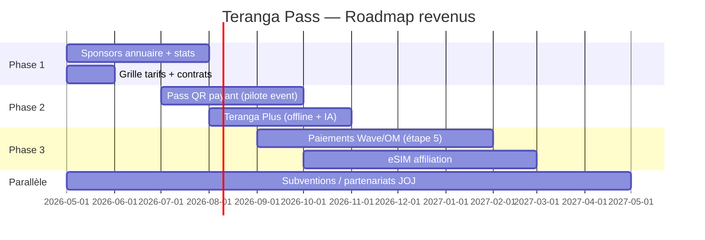

# Teranga Pass — Guide de monétisation

**Dernière mise à jour** : mai 2026  
**Public** : fondateur, produit, partenariats, investisseurs  
**Statut technique** : inventaire basé sur le dépôt `terangapass` (app Flutter + API Laravel)

> **Pour la direction (sans jargon technique)** : lire d’abord  
> **[MONETISATION_SYNTHESE_DIRECTION.md](MONETISATION_SYNTHESE_DIRECTION.md)** — tableau « ce qu’on peut vendre maintenant », priorités et chiffres indicatifs.

Ce document liste **ce qui existe déjà**, **ce qui est partiellement prêt**, et **ce que vous pouvez ajouter** pour générer des revenus — sans engagement de livraison ni conseil juridique/fiscal.

**Documents liés** :
- [TerangaPass_Plan_Etape_par_Etape.md](TerangaPass_Plan_Etape_par_Etape.md)
- [TerangaPass_Etape5_Paiements_Prerequis.md](TerangaPass_Etape5_Paiements_Prerequis.md) — paiements in-app (reportés)
- [TerangaPass_Etape6_Pass_QR.md](TerangaPass_Etape6_Pass_QR.md) — billetterie QR pilote
- [TerangaPass_Etape7_Offline_Pack.md](TerangaPass_Etape7_Offline_Pack.md) — pack hors ligne
- [TerangaPass_Inspirations_Strategie.md](TerangaPass_Inspirations_Strategie.md) — vision super-app, partenaires institutionnels

---

## 1. Synthèse exécutive

| Constats | Implication |
|----------|-------------|
| **Aucun paiement in-app** aujourd’hui (Wave, Orange Money, Stripe, etc.) | Les revenus **transactionnels** passent par un chantier dédié (étape 5) |
| **Infrastructure « partenaire sponsor »** déjà en base (`is_sponsor`) | Vous pouvez **facturer des mises en avant** sans nouveau gros module |
| **~2 500+ POI** (annuaire + sync Google Places) | Actif B2B fort : **annuaire pro payant** au Sénégal entier |
| **Pass QR JOJ** opérationnel mais **gratuit** (pilote) | Prochain levier : billetterie / accès payant |
| **eSIM** = écran « bientôt » (Airalo, PayDunya, Wave mentionnés) | Revenus **affiliation / commission** possibles une fois branché |
| **SOS, alertes, incidents** | Plutôt **B2G / B2B institutionnel** (villes, assurances, hôtellerie) que vente aux touristes |

**Ordre recommandé pour les premiers euros** : (1) sponsors annuaire → (2) forfaits établissements → (3) Pass QR payant → (4) offline / IA premium → (5) paiements & eSIM.

---

## 2. Ce qui existe déjà (monétisable sans tout recoder)

### 2.1 Annuaire & tourisme (B2B local)

| Élément | Détail technique | Monétisation |
|---------|------------------|--------------|
| **Fiche partenaire** | Table `partners`, admin CRUD, 20+ catégories | Abonnement mensuel « fiche pro » |
| **Sync Google Places** | `places:sync-google`, 24 zones Sénégal | Pack « import + mise à jour » pour un réseau (chaîne hôtelière, banques) |
| **Géolocalisation & distance** | API `nearby`, `tourism/points-of-interest` | Classement « les plus proches » = valeur pour le commerçant |
| **Avis utilisateurs** | `poi_reviews`, écran détail lieu | Option « réponses du propriétaire », badge vérifié |
| **Photos / logo** | `logo_url`, `photos`, résolution Google côté serveur | Upsell « galerie premium » (plus de photos, mise en avant) |

**Écrans mobile** : `tourism_screen.dart`, `nearby_screen.dart`, `place_detail_screen.dart`, `map_screen.dart`.

### 2.2 Partenaires sponsorisés (déjà codé)

| Élément | Détail | Limite actuelle |
|---------|--------|-----------------|
| Champ **`is_sponsor`** | Admin : case « Sponsor officiel » (`partners/create`) | Pas de date d’expiration ni de forfait automatique |
| **Tri prioritaire** | `NearbyController` : sponsors en premier, puis distance | **Pas** sur la liste Tourisme ni sur tous les marqueurs carte |
| **Badge UI** | « Partenaire » (`nearby_screen.dart`), légende carte | À étendre partout pour justifier le prix |

**Idée prix (indicatif)** : 25 000 – 150 000 FCFA / mois selon ville, catégorie et emplacement (À deux pas + carte + annuaire).

### 2.3 Pass QR (billetterie pilote)

| Élément | Détail | Monétisation |
|---------|--------|--------------|
| **Billet signé** | `PassTicket`, `GET /api/v1/pass/ticket`, `pass_qr_screen.dart` | Vente billet JOJ, musée, navette |
| **Contrôle entrée** | Validation staff (`X-Teranga-Pass-Control`) | Licence « lecteur QR » pour opérateurs |
| **Admin** | Révocation / réémission | Support payant événements |

**Aujourd’hui** : ticket pilote **gratuit** auto-généré (`joj_visitor_pilot`). Le commentaire code dit explicitement « sans paiement in-app ».

### 2.4 Pack hors ligne

| Élément | Détail | Monétisation |
|---------|--------|--------------|
| **Téléchargement bundles** | POI, sites JOJ, ambassades, calendrier, audio | **Premium** : pack « Dakar complet » ou « Sénégal voyage » |
| **Sync manifeste** | `OfflinePackController`, profil utilisateur | Abonnement annuel touristes (type guide Lonely Planet numérique) |

**Aujourd’hui** : gratuit pour tous les utilisateurs connectés.

### 2.5 Assistant IA

| Élément | Détail | Monétisation |
|---------|--------|--------------|
| **Chat Claude** | `POST /api/v1/ai/chat`, `ai_assistant_screen.dart` | Freemium : X messages / jour gratuits, illimité en premium |
| **Coût variable** | API Anthropic côté serveur | Obligation de plafond ou abonnement |

### 2.6 Notifications & annonces audio

| Élément | Détail | Monétisation |
|---------|--------|--------------|
| **Push ciblés** | FCM, admin envoi | Campagne sponsor (restaurant, opérateur telco) |
| **Annonces audio officielles** | `audio_announcements` | Message sponsor JOJ / ministère (CPM ou forfait) |

### 2.7 Transport & JOJ

| Élément | Détail | Monétisation |
|---------|--------|--------------|
| **Navettes** | `transport_screen.dart`, admin transport | Commission réservation ou listing opérateur |
| **Sites & calendrier JOJ** | `joj_info_screen.dart` | Partenariat comité d’organisation, contenu exclusif |

### 2.8 Sécurité (SOS, médical, incidents)

| Élément | Détail | Monétisation |
|---------|--------|--------------|
| **SOS / alerte médicale** | API + dashboard temps réel | **Licence** hôtels, universités, organisateurs d’événements |
| **Signalement incidents** | Photos, audio, suivi | Contrat ville / police municipale / assurance |

**Attention éthique** : ne pas faire payer le **SOS d’urgence** au citoyen ; monétiser l’**infrastructure** côté institution ou B2B.

### 2.9 Ambassades & services publics

| Élément | Détail | Monétisation |
|---------|--------|--------------|
| **Annuaire diplomatique** | `embassies_screen.dart` | Faible direct ; crédibilité « app officielle » pour vendre le reste |
| **Convertisseur devises** | `currency_converter_screen.dart` | Affiliation banque / change ; pub discrète |

### 2.10 Comptes utilisateurs & admin

| Élément | Détail | Monétisation |
|---------|--------|--------------|
| **Inscription / connexion** | Bearer token, blocage compte | Base pour abonnement « Teranga Pass Plus » |
| **Statistiques admin** | `StatisticsController`, compteur `sponsor_ads` | Reporting vendu aux annonceurs |

---

## 3. Ce qui est annoncé mais pas encore monétisable (à construire)

| Fonctionnalité | État dans l’app | Piste revenu | Référence |
|----------------|-----------------|--------------|----------|
| **Paiements Wave / Orange Money / PayDunya** | Non implémenté | Commission 2–5 % sur billet, don, réservation | [Étape 5](TerangaPass_Etape5_Paiements_Prerequis.md) |
| **eSIM** | `esim_coming_screen.dart` — texte Airalo, Wave | Commission affiliation eSIM touristes | ARB `esimComingBody` |
| **Abonnement premium utilisateur** | Pas de champ `plan` / `premium_until` en base | 2 000 – 10 000 FCFA / mois | À créer |
| **Tracking `visit_count`** | Colonne existe, **jamais incrémentée** | Facturation au clic / vue fiche | `Partner.visit_count` |
| **Sponsor sur carte + tourisme** | Seulement « À deux pas » | Forfait « visibilité totale » | Évolution UI |
| **Portail self-service annonceur** | Tout passe par admin Laravel | Réduction coût commercial | Nouveau module web |

---

## 4. Modèles de revenus (matrice)

### 4.1 Revenus récurrents (B2B)

| Offre | Cible | Fourchette indicative (FCFA/mois) | Prérequis produit |
|-------|--------|-----------------------------------|-------------------|
| **Fiche standard** | Restaurant, pharmacie, garage | 10 000 – 30 000 | Fiche active + 1 photo |
| **Partenaire sponsor** | Hôtel, banque, enseigne | 50 000 – 200 000 | `is_sponsor` + badge partout + stats vues |
| **Catégorie exclusive** | Ex. « seule banque mise en avant » | Sur devis | Un seul sponsor / catégorie / zone |
| **Pack ville** | Office tourisme Thiès, Saint-Louis | 500 000 – 2 M / an | Contenu éditorial + POI locaux |
| **Licence dashboard** | Hôtel 5★, comité JOJ | Sur devis | Accès alertes / stats zone |

### 4.2 Revenus transactionnels (nécessitent paiements — étape 5)

| Offre | Marge type | Notes |
|-------|------------|-------|
| **Billet JOJ / musée / concert** | 5–15 % + frais fixe | Pass QR déjà prêt côté technique |
| **Réservation restaurant / hôtel** | 8–15 % | Lien partenaire ou booking intégré |
| **Vente eSIM** | 10–25 % commission Airalo | Partenaire à contractualiser |
| **Don / crowdfunding événement** | 2–5 % | Via Wave OM agréé |

### 4.3 Revenus utilisateur final (B2C)

| Offre | Prix indicatif | Contenu |
|-------|----------------|---------|
| **Teranga Pass Plus** (mensuel) | 1 500 – 5 000 FCFA | Offline illimité, IA illimitée, pas de pub |
| **Pack offline « Sénégal »** (achat unique) | 2 000 – 8 000 FCFA | Téléchargement complet POI + cartes |
| **Pass JOJ visiteur** (événement) | 5 000 – 50 000 FCFA / billet | QR + accès sites |

### 4.4 Revenus institutionnels & subventions (non « app store »)

| Source | Argumentaire |
|--------|--------------|
| **Ministère Tourisme / ASPT** | App vitrine destination, données agrégées anonymisées |
| **Ville de Dakar / régions** | Smart city, sécurité visiteur, JOJ |
| **AFD, BAD, UE Team Europe** | Tourisme numérique, inclusion |
| **Sponsors événement** | Orange, Free, banques : branding home + notifications |

Voir tableau détaillé dans [TerangaPass_Inspirations_Strategie.md](TerangaPass_Inspirations_Strategie.md).

### 4.5 Revenus publicité (attention UX)

| Format | Où | Risque |
|--------|-----|--------|
| **Bannière home** | Sous la bannière héros | Dégrade l’image « app officielle » |
| **Interstitiel** | À l’ouverture | Forte désinstallation |
| **Sponsor natif** | Liste POI, carte | **Recommandé** — déjà aligné avec `is_sponsor` |
| **Push sponsor** | Notification | Opt-in strict, plafond fréquence |

**Recommandation** : privilégier le **natif sponsor** plutôt que AdMob générique pour une app institutionnelle / JOJ.

---

## 5. Fonctionnalités à ajouter (par priorité business)

### Priorité 1 — Rapide (1–4 semaines)

1. **Forfait sponsor complet**  
   - Étendre `is_sponsor` à Tourisme + carte + détail lieu.  
   - Afficher stats : vues fiche, clics appel, clics itinéraire (`visit_count` + events analytics).

2. **Grille tarifaire PDF + page admin « Contrat sponsor »**  
   - Dates début/fin, montant, catégories (migration `sponsor_until`, `sponsor_plan`).

3. **Bouton « Réserver / Appeler / Itinéraire » tracké**  
   - Mesure pour justifier le renouvellement annonceur.

4. **Formulaire web « Devenir partenaire »** (hors app)  
   - Lead → admin crée la fiche.

### Priorité 2 — Moyen (1–3 mois)

5. **Pass QR payant**  
   - Lier émission ticket à paiement confirmé (étape 5).  
   - Types : `joj_day_pass`, `museum_entry`, etc.

6. **Teranga Pass Plus**  
   - Champs user + middleware API + paywall offline / IA.

7. **Portail partenaire light**  
   - Login commerçant : modifier horaires, photo, promo (sans toucher au code admin global).

8. **Notifications géolocalisées sponsor**  
   - Ex. « -10 % au restaurant X à 200 m » (opt-in).

### Priorité 3 — Stratégique (3–12 mois)

9. **Intégration eSIM (Airalo ou autre)**  
   - Deep link achat + commission.

10. **Wallet / paiement in-app** (Wave, OM, PayDunya)  
    - Réservations, billets, pourboire guide.

11. **Marketplace services** (guide, taxi certifié, transfert aéroport)  
    - Commission type super-app (cf. Kaspi dans doc inspirations).

12. **API données tourisme B2B**  
    - Vendre flux agrégés (anonymisés) aux OT et chercheurs.

13. **White-label**  
    - Même moteur pour un autre pays / événement (licence logicielle).

---

## 6. Ce qu’il ne faut pas monétiser (risque réputation)

| Fonctionnalité | Pourquoi |
|----------------|----------|
| **SOS / urgence médicale** | Accès gratuit vital ; facturer l’**hébergeur** du service, pas la victime |
| **Ambassades / numéros secours** | Crédibilité institutionnelle |
| **Carte et navigation de base** | Attendu gratuit pour adoption massive JOJ |
| **Alertes sécurité officielles** | Message public = gratuit |

---

## 7. Roadmap monétisation suggérée (12 mois)

| Phase | Objectif CA | Actions clés |
|-------|-------------|--------------|
| **T0 – T+3 mois** | Premiers sponsors locaux | 10–30 fiches payantes, 3–5 sponsors « mis en avant », KPI vues |
| **T+3 – T+6 mois** | Événement / JOJ | Billetterie QR payante, packs offline, 1–2 contrats institutionnels |
| **T+6 – T+12 mois** | Scale | Paiements, eSIM, portail partenaire, extension hors Dakar |

---

## 8. KPI à suivre (pour vendre et piloter)

| KPI | Usage | État actuel |
|-----|-------|-------------|
| **Vues fiche POI** | Facturation CPM sponsor | `visit_count` non alimenté — **à implémenter** |
| **Clics appel / itinéraire** | Preuve de lead | Non tracké — **à implémenter** |
| **Nombre de sponsors actifs** | Dashboard admin | Oui (`sponsor_ads`) |
| **MAU / rétention** | Vente pub & institutionnel | Analytics Firebase à configurer si absent |
| **Téléchargements offline** | Upsell pack premium | Possible via logs API manifest |
| **Messages IA / user** | Coût vs abonnement Plus | Non plafonné |
| **Billets QR émis / scannés** | Billetterie | Admin pass-tickets |

---

## 9. Stack technique à prévoir pour la monétisation

| Besoin | Solution suggérée |
|--------|-------------------|
| Paiement mobile Sénégal | **Wave**, **Orange Money**, **PayDunya** (cf. étape 5) |
| Abonnement récurrent | Stripe (carte diaspora) + OM local selon agrément |
| eSIM | **Airalo** API / programme affiliation |
| Facturation B2B | PDF + virement ; plus tard facture électronique |
| Analytics | Firebase Analytics + events custom `poi_view`, `sponsor_impression` |
| Contrôle sponsor | Migration DB : `sponsor_starts_at`, `sponsor_ends_at`, `plan_slug` |

---

## 10. Checklist « premier euro »

- [ ] Rédiger **3 forfaits** (Standard / Sponsor / Premium) avec prix FCFA et livrables.
- [ ] Contacter **10 établissements** déjà dans l’annuaire (hôtels, restos) avec maquette « avant / après sponsor ».
- [ ] Activer **stats de vues** (incrément `visit_count` + tableau admin).
- [ ] Étendre le **badge sponsor** sur Tourisme et carte (justifier le forfait).
- [ ] Proposer **1 pilote payant Pass QR** (concert, site JOJ secondaire).
- [ ] Lancer **dossier subvention** (tourisme / JOJ) en parallèle — voir inspirations institutionnelles.
- [ ] Planifier **étape 5 paiements** quand un PSP et un flux unique sont choisis.

---

## 11. Résumé une page

**Vous pouvez déjà gagner de l’argent** avec :
- l’**annuaire pro** (fiches + Google Places + avis) ;
- les **sponsors** (`is_sponsor`, surtout « À deux pas » aujourd’hui) ;
- les **contrats institutionnels** (SOS, données, visibilité JOJ) ;
- le **Pass QR** (billetterie une fois payant) ;
- le **pack offline** et l’**IA** en freemium.

**Il manque surtout** :
- les **paiements in-app** ;
- le **suivi des vues / clics** pour prouver la valeur ;
- l’**uniformisation sponsor** sur tous les écrans ;
- l’**eSIM** et le **portail annonceur**.

**Prochaine étape produit recommandée** : stats + forfaits sponsor + 5 clients pilotes payants, **avant** de complexifier wallet et super-app.

---

*Document interne Teranga Pass — à faire évoluer avec les retours terrain et le cadre juridique sénégalais.*
